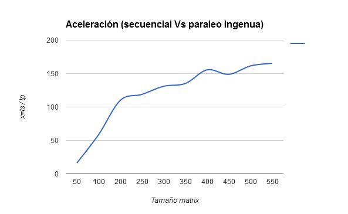

#Multiplicación de matrices
####Parcial 1 - HPC
#####Introducción
Se realizó la codificación de tres algoritmos los cuales deben cumplir con el mismo objetivo, para así realizar una comparación de desempeño de ellos, el objetivo de los algoritmos consta de multiplicar dos matrices. En la carpeta *source* se encontrará la codificación de las tres soluciones, una secuencial implementada en *C* y otras dos paralelas usando *Cuda C*, una de ellas es una solución ingenua y la otra usa memoria compartida, ambos algoritmos paralelos fueron ejecutados en una GPU Nvidia Gforce GTx 780, la cual fue puesta a disposición para pruebas del curso por el semillero de la facultada de ingenierías *Sirius*.

A continuación se muestran las tablas con los datos obtenidos en las pruebas comparativas, los datos usados para el análisis son: el tiempo de ejecución del algoritmo secuencial *Ts*, el tiempo de ejecución del algoritmo paralelo ingenuo *Tp* y el tiempo de ejecución del algoritmo paralelo usando memoria compartida *Tt*, haciendo una variación en el tamaño de las matrices cuadradas para cada tabla, además se calcula la aceleración *X* de ls siguientes manera: *x = Ts / TP* en el caso de la comparación del algoritmo secuencial versus el paralelo ingenuo y *x = Ts / Tt* en el caso de la comparación del algoritmo secuencial versus el paralelo usando memoria compartida.

#####Tabla algoritmo secuencial versus paralelo ingenuo
*En la siguiente tabla se encuentran registrados los tiempos promedio de ambos algoritmos para cada tamaño de matriz cuadrada*

**Tamaño matrix**|	**Ts**|	**Tp**|	**x=ts / tp**
----------|-----------|-------|-------|--------------
50|	0.0008717777778|	0.000053666667|	16.24430642
100|	0.005308111111|	0.000090666667|	58.54534314
200	|0.03116722222|	0.0002836666667	|109.8726988
250	|0.05918655556|	0.0004976666667	|118.928109
300	|0.09784588889|	0.000746777778	|131.0241036
350	|0.1564504444	|0.001157	|135.2207817
400	|0.2316638889	|0.001488888889	|155.5951493
450	|0.3450582222	|0.002317444444	|148.8960061
500	|0.4778181111	|0.002958777778	|161.4917196
550	|0.6461072222	|0.003907555556|	165.3481859

*Ver tablas completas con el conjunto de datos con los cuales se obtuvieron los anteriores promedios*
[Ver tablas](https://docs.google.com/spreadsheets/d/1o_RRmzr3Mnd59_kJS9YmxhFSW7GESxPt83-B3bmIxpw/edit?usp=sharing)

#####Gráfica de aceleración

